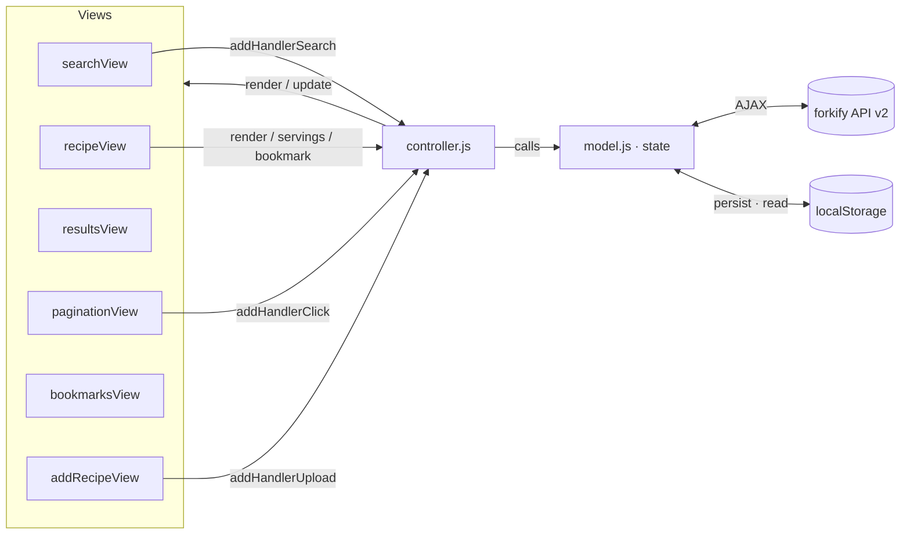
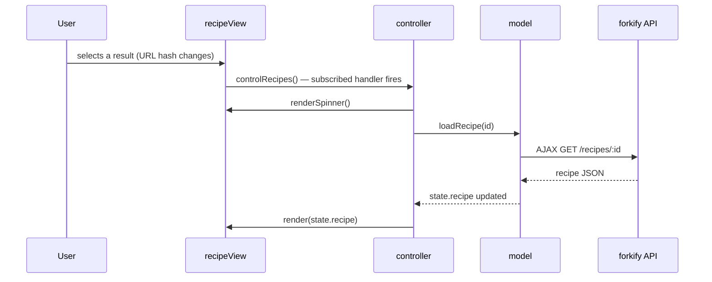

<div align="center">


# forkify

**Search over 1,000,000 recipes, scale servings on the fly, bookmark your favourites, and publish your own — a modern, single-page application built in vanilla JavaScript.**

[](https://forkify-rzgar.netlify.app/)
&nbsp;
[](#)
[](#)
[](#)
[](#)
[](https://forkify-rzgar.netlify.app/)
[](#license)

[**Live Demo**](https://forkify-rzgar.netlify.app/) · [Features](#key-features) · [Architecture](#architecture) · [Getting Started](#getting-started)

<br/>


</div>

---

## Overview

**forkify** is a single-page recipe application that lets you search a public database of over a million recipes, read full cooking instructions, dynamically scale ingredient quantities to the number of servings you need, bookmark recipes for later (persisted in the browser), and even upload your own recipes to the API.

It is built **without any framework** — pure ES6+ JavaScript organised around a clean **MVC architecture** and the **publisher–subscriber pattern**, bundled with **Parcel** and styled with **Sass**. The project is a study in structuring a non-trivial front-end application so that business logic, presentation, and application flow stay fully decoupled and testable.

> **Try it live:** open the [demo](https://forkify-rzgar.netlify.app/) and search for any ingredient — `pizza`, `avocado`, `pasta`…

---

## Key Features

| Feature | Description |
| --- | --- |
| **Recipe search** | Query the forkify API for any ingredient or dish and browse the results in a responsive sidebar. |
| **Pagination** | Results are paginated (10 per page) with dynamic previous/next controls. |
| **Detailed recipe view** | Cooking time, servings, full ingredient list with smart quantity formatting, and a link to the original source. |
| **Dynamic servings** | Increase or decrease servings and every ingredient quantity recalculates instantly — without re-rendering the whole view. |
| **Bookmarks** | Save and remove favourites; bookmarks are persisted to `localStorage` and restored on reload. |
| **Upload your own recipe** | A modal form lets you publish a custom recipe to the API, with input validation and automatic bookmarking. |
| **Fraction formatting** | Quantities are rendered as readable fractions (e.g. `0.5` → `½`) via the `fracty` library. |
| **Robust async handling** | Every network request is wrapped with a timeout race and surfaces friendly loading, error, and success states. |
| **Responsive UI** | Fluid layout with loading spinners, error panels, and success messages for a polished UX. |

---

## Tech Stack

| Layer | Technology |
| --- | --- |
| **Language** | JavaScript (ES6+ modules) |
| **Styling** | Sass (modular `7-1`-style partials) |
| **Bundler** | Parcel 2 (`@parcel/transformer-sass`) |
| **Tooling** | Node.js & npm (Parcel dev server and production build) |
| **Polyfills** | `core-js` · `regenerator-runtime` (targeted via `browserslist`) |
| **Fractions** | `fracty` |
| **Data source** | forkify API v2 (REST) |
| **Persistence** | Browser `localStorage` |
| **Hosting** | Netlify |

---

## Architecture

The codebase follows a strict **Model–View–Controller** separation, wired together with a **publisher–subscriber** pattern so that views never call the controller directly — they expose `addHandler*` subscription methods, and the controller injects its handlers at startup.

- **Model (`model.js`)** — owns the single `state` object and all business logic: fetching recipes, search + pagination slicing, servings recalculation, and bookmark persistence. It is the only layer that talks to the API and `localStorage`.
- **Views (`views/`)** — each UI area is its own class extending a shared **base `View`** that provides `render()`, a diffing `update()`, `renderSpinner()`, `renderError()`, and `renderMessage()`. Inheritance keeps every view DRY.
- **Controller (`controller.js`)** — the thin orchestration layer. It subscribes handlers to view events and coordinates the flow between model and views. It contains no business logic of its own.

A notable detail is the custom **DOM-diffing `update()`** method in the base `View`: instead of re-rendering an entire section, it builds the new markup in memory, compares it node-by-node against the live DOM, and patches **only** the text nodes and attributes that actually changed. This powers the instant servings update and bookmark toggle without flicker or full re-renders.



### Data flow: loading a recipe



---

## Project Structure

```text
forkify/
├── index.html
├── package.json
└── src/
    ├── img/
    │   ├── favicon.png
    │   ├── icons.svg
    │   └── logo.png
    ├── js/
    │   ├── config.js          # API URL, API key, constants
    │   ├── helpers.js         # AJAX wrapper with timeout race
    │   ├── model.js           # state + business logic
    │   ├── controller.js      # application logic (pub/sub glue)
    │   └── views/
    │       ├── View.js        # base class: render / update / spinner / error
    │       ├── recipeView.js
    │       ├── resultsView.js
    │       ├── previewView.js
    │       ├── searchView.js
    │       ├── paginationView.js
    │       ├── bookmarksView.js
    │       └── addRecipeView.js
    └── sass/                  # modular partials
        ├── main.scss
        ├── _base.scss
        ├── _components.scss
        ├── _header.scss
        ├── _preview.scss
        ├── _recipe.scss
        ├── _searchResults.scss
        └── _upload.scss
```

---

## Getting Started

### Prerequisites

- [Node.js](https://nodejs.org/) (LTS recommended) and npm

### Installation

```bash
# 1. Clone the repository
git clone https://github.com/R3zgar/forkify.git
cd forkify

# 2. Install dependencies
npm install

# 3. Start the development server (Parcel)
npm start
```

Parcel serves the app at `http://localhost:1234` with hot-reloading.

### Build for production

```bash
npm run build
```

The optimised, bundled output is written to the `./dist` directory.

> **Note on the API key:** the app ships with a demo key in `src/js/config.js`. Searching and reading recipes works out of the box; to **upload your own recipes** under your own account, replace the `KEY` constant with a personal key from the forkify API.

---

## Deployment

The app is continuously deployed to **Netlify**.

| Setting | Value |
| --- | --- |
| **Build command** | `npm run build` |
| **Publish directory** | `dist` |

Live at **[forkify-rzgar.netlify.app](https://forkify-rzgar.netlify.app/)**.

---

## Ideas for further development

- Migrate the codebase to **TypeScript** for end-to-end type safety.
- Add **unit tests** for the model (search slicing, servings maths, bookmark logic).
- **Debounce** the search input and add skeleton loaders for results.
- Turn the app into an installable **PWA** with offline access to bookmarked recipes.

---

## Author

**Rzgar Bapiri**
GitHub: [@R3zgar](https://github.com/R3zgar)

---

## Acknowledgements

The application concept and overall architecture are based on the *forkify* project from Jonas Schmedtmann's **The Complete JavaScript Course**. This repository is my own implementation, refactoring, and deployment of that project — built to practise large-scale vanilla-JavaScript architecture: MVC, the publisher–subscriber pattern, ES6 modules, and asynchronous data flows.

---

## License

Released under the **ISC License**.
